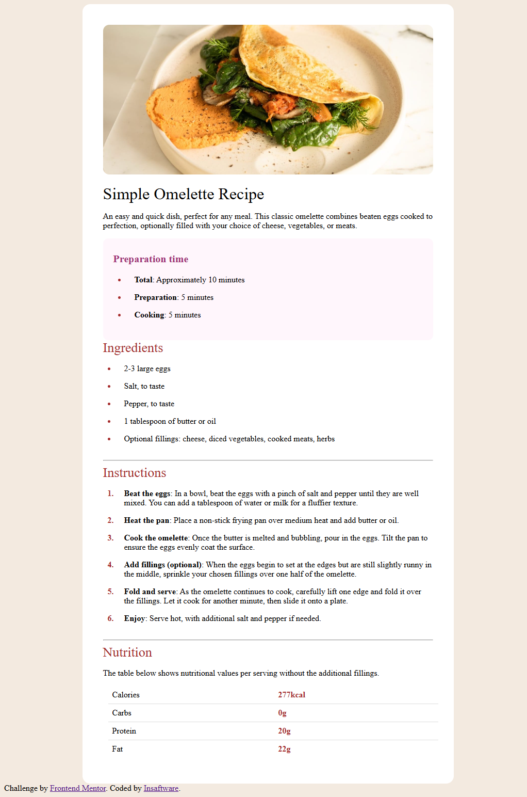

1-Screenshot:

2-Built with:
- Semantic HTML5 markup
- CSS custom properties
- Mobile-first workflow

3-What I learned:
@media and responsive css ,
tables without borders

4-Useful resources:
- [w3schools](https://www.w3schools.com/) - This helped me in tables and responsive css. I really liked this pattern and will use it going forward.

5-Author
- Frontend Mentor - [INSAF-AYA](https://www.frontendmentor.io/profile/INSAF-AYA)